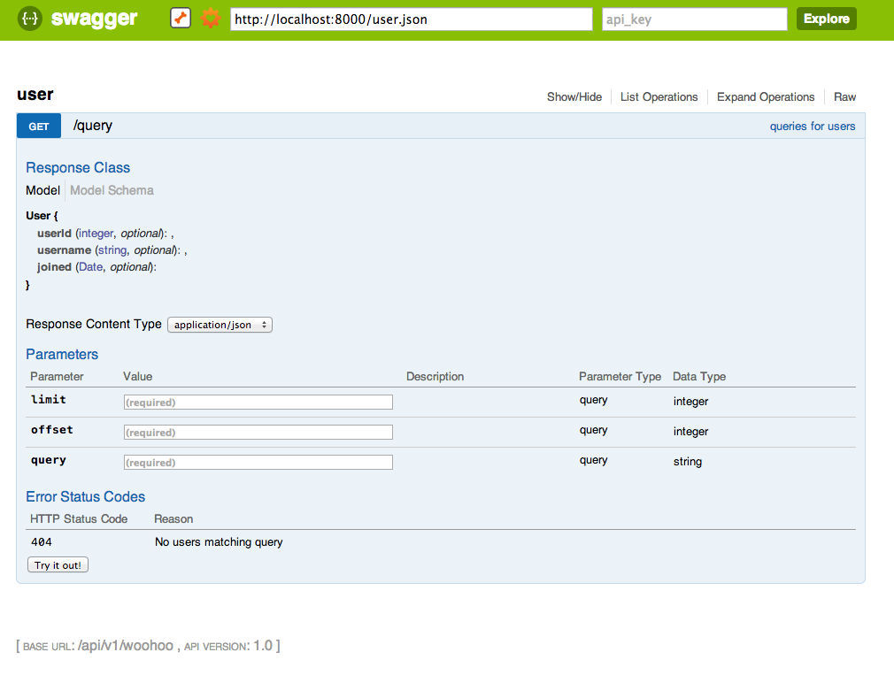

# bluster

A Clojure library designed to ... generate JSON for SwaggerUI.

Designed to be lightweight, unopinionated, and mesh nicely with
any framework or webapp.

Specific schema/type system library integration possibly
coming later (schema, clj-schema, core.typed).

## Leiningen


## What it does right now

Saves some boilerplate in the resultant JSON

## What it might do in the future

http://docs.emmet.io esque DSL

## What it will never do

Never going to make it implement the whole RESTful service/server for you like Octohipster

## Example

```clojure
(ns my-ns
  (:require [bluster.ing.into.nice.api.docs.generate :refer [scaffold-resource]]))

(def user-model
  {:properties {:userId   {:type "integer"}
                :username {:type "string"}
                :joined   {:type "Date"}}})

(def user-api
  {:path "/query"
   :description "Paginated querying of users"
   :operations [{:parameters [{:name "limit"
                               :paramType "query"
                               :dataType "integer"}
                              {:name "offset"
                               :paramType "query"
                               :dataType "integer"}
                              {:name "query"
                               :paramType "query"
                               :dataType "string"}
                              ]
                 :summary "queries for users"
                 :httpMethod "GET"
                 :responseClass "Array[User]"
                 :errorResponses
                 [{:reason "No users matching query" :code 404}]}]})

(def user-resource
  {:resourcePath "/user"
   :basePath     "/api/v1/woohoo"
   :apiVersion   "1.0"
   :models       {:User user-model}
   :apis         [user-api]
   })

(scaffold-resource user-resource) ;; will return:

;; Just covert this to JSON to get a valid Swagger resource.
  {:apis
   [{:path "/query",
     :operations
     [{:errorResponses [{:reason "No users matching query", :code 404}],
       :responseClass "Array[User]",
       :httpMethod "GET",
       :parameters
       [{:allowMultiple false,
         :name "limit",
         :paramType "query",
         :dataType "integer",
         :required true,
         :description ""}
        {:allowMultiple false,
         :name "offset",
         :paramType "query",
         :dataType "integer",
         :required true,
         :description ""}
        {:allowMultiple false,
         :name "query",
         :paramType "query",
         :dataType "string",
         :required true,
         :description ""}],
       :nickname "",
       :summary "queries for users"}],
     :description "Paginated querying of users"}],
   :models
   {:properties
    {:uniqueItems false,
     :type "Date",
     :required false,
     :format "int64",
     :description ""},
    :uniqueItems [],
    :required false,
    :type "any",
    :id :User},
   :resourcePath "/user",
   :basePath "/api/v1/woohoo",
   :apiVersion "1.0",
   :swaggerVersion
   "1.0"}

```

Screenshot of the above:



## License

Copyright © 2013 Chris Allen

Distributed under the Eclipse Public License either version 1.0 or (at
your option) any later version.
